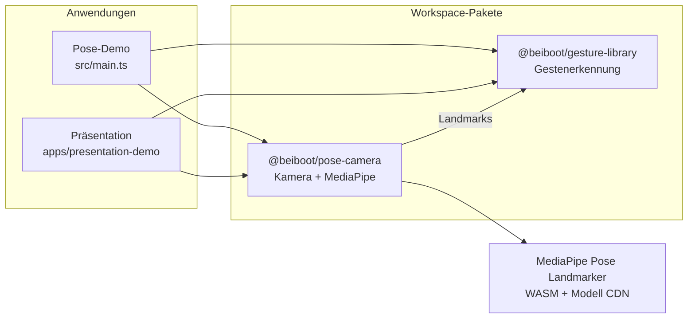

# Architekturüberblick

## Zuständigkeiten

| Schicht | Verantwortung |
| --- | --- |
| Apps | UI, Domänenlogik (Folien), Konsum der öffentlichen APIs |
| `@beiboot/pose-camera` | Webcam, Inferenz, Landmark-Rendering |
| `@beiboot/gesture-library` | Features, Stabilisierung, Gesten-Plugins, Events |

## Trade-offs (Kurz)

- Heuristiken statt ML-Klassifikator: debuggbar, aber begrenzte Robustheit (ADR 005–007).
- Clientseitige Inferenz: Datenschutz besser als Server-ML, aber geräteabhängig (ADR 001).
- Pose-Loss-Grace / EMA: weniger Fehlabbrüche, etwas mehr Latenz (Baseline K3/K4).

Details: [ADRs](adr/).
